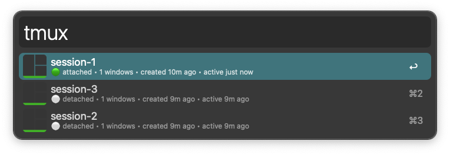
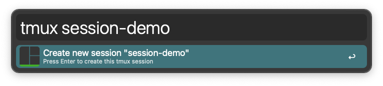

# Alfred Tmux Sessions


A powerful Alfred workflow for complete tmux session management. List, create, attach, detach, and delete sessions with rich status info via the `tmux` keyword.



## Setup

### Requirements

- macOS
- [Alfred](https://www.alfredapp.com/) with Powerpack
- [tmux](https://github.com/tmux/tmux) - Install via `brew install tmux`
- [iTerm2](https://iterm2.com/) (recommended terminal)

### Download

1. Download the latest [tmux-sessions.alfredworkflow](../../releases/latest)
2. Double-click the file to install in Alfred
3. Grant necessary permissions when prompted

### Verification

Test the workflow by typing `tmux` in Alfred. If you see "tmux not found", install tmux with:

```bash
brew install tmux
```

## Usage

**List and search tmux sessions** via the `tmux` keyword. Results are intelligently sorted (attached sessions first, then by recent activity) and can be filtered instantly by typing any part of a session name. Each session displays:
- 🟢 **Attached** or ⚪ **Detached** status
- **Window count** and **creation time** 
- **Last activity** timestamp

### Actions

* <kbd>⏎</kbd> **Attach to session** - Opens in new iTerm window
* <kbd>⌘</kbd><kbd>⏎</kbd> **Delete session** - Permanently removes the session
* <kbd>⌃</kbd><kbd>⏎</kbd> **Detach from session** - Disconnects clients (attached sessions only)

### Create New Sessions

Type `tmux` followed by a new session name to create it instantly:



* <kbd>⏎</kbd> **Create and attach** - Creates the session and opens in iTerm

The workflow also provides:
- **Input validation** to prevent invalid session names with helpful error messages
- **Rich notifications** with success and error feedback for all operations

## Configuration

The workflow works out-of-the-box with no configuration required. However, you can:

- **Customize notifications**: macOS notification settings control workflow feedback
- **Change keyword**: Alfred Preferences → Workflows → Tmux Sessions → Script Filter
- **View logs**: Check `~/Library/Logs/Alfred/alfred-tmux-sessions.log` for debugging

## Troubleshooting

### Common Issues

**"tmux not found"**
- Install tmux: `brew install tmux`
- Verify installation: `tmux --version`

**"Session ended very soon after starting"**
- Check your iTerm2 default profile settings
- Ensure tmux is in your PATH

**Sessions not showing**
- Verify tmux sessions exist: `tmux list-sessions`
- Check the debug log at `~/Library/Logs/Alfred/alfred-tmux-sessions.log`

## Limitations

- Requires iTerm2 for optimal experience (Terminal.app may work but is untested)
- Session names cannot contain spaces, dots, or colons (tmux limitation)
- Detach action only works on sessions with active clients

## Development

The workflow consists of:
- **Python script** (`src/tmux-sessions.py`) - Session listing and filtering
- **AppleScript** (`src/tmux-action.scpt`) - Session operations and iTerm integration

### Building from Source

```bash
git clone https://github.com/JasonSatti/alfred-tmux-sessions.git
cd alfred-tmux-sessions

# Import workflow files manually into Alfred
# Or modify and export your own .alfredworkflow
```

## License

MIT License - see [LICENSE](LICENSE) for details.

---

If this workflow saves you time, consider [⭐ starring the repo](https://github.com/JasonSatti/alfred-tmux-sessions) to help others discover it!
