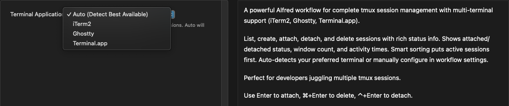

# Alfred Tmux Sessions


A powerful Alfred workflow for complete tmux session management with multi-terminal support (iTerm2, Ghostty, Terminal.app). List, create, attach, detach, and delete sessions with rich status info via the `tmux` keyword.


## Setup

### Requirements

- macOS 10.14+
- [Alfred](https://www.alfredapp.com/) 4.0+ with Powerpack
- [tmux](https://github.com/tmux/tmux) 3.2+ - Install via `brew install tmux`
- At least one supported terminal:
  - [iTerm2](https://iterm2.com/) - Install via `brew install --cask iterm2`
  - [Ghostty](https://ghostty.org/) - Install via `brew install --cask ghostty`
  - Terminal.app (built-in fallback)

### Download

1. Download the latest [Tmux Sessions Alfred Workflow](https://github.com/JasonSatti/alfred-tmux-sessions/releases/latest)
2. Double-click the file to install in Alfred
3. Grant necessary permissions when prompted

### Verification

Test the workflow by typing `tmux` in Alfred. If you see "tmux not found", install tmux with:

```bash
brew install tmux
```

## Usage

**List and search tmux sessions** via the `tmux` keyword. Results are intelligently sorted (attached sessions first, then by recent activity) and can be filtered instantly by typing any part of a session name. Each session displays:
- 🟢 **Attached** or ⚪ **Detached** status
- **Window count** and **creation time** 
- **Last activity** timestamp

### Actions

* <kbd>⏎</kbd> **Attach to session** - Opens in new terminal window
* <kbd>⌘</kbd><kbd>⏎</kbd> **Delete session** - Permanently removes the session
* <kbd>⌃</kbd><kbd>⏎</kbd> **Detach from session** - Disconnects clients (attached sessions only)

### Create New Sessions

Type `tmux` followed by a new session name to create it instantly:


* <kbd>⏎</kbd> **Create and attach** - Creates the session and opens in your configured terminal

The workflow also provides:
- **Input validation** to prevent invalid session names with helpful error messages
- **Rich notifications** with success and error feedback for all operations

## Configuration

### Terminal Selection

The workflow automatically detects your preferred terminal, but you can manually configure it:

1. **Access Configuration**: Right-click the workflow in Alfred Preferences → "Configure Workflow..."
2. **Terminal Application**: Choose from the dropdown:
   - **Auto (Detect Best Available)** - Automatically selects iTerm2 → Ghostty → Terminal.app
   - **iTerm** - Force iTerm2 usage
   - **Ghostty** - Force Ghostty usage
   - **Terminal** - Use built-in Terminal.app



### Ghostty Setup

If using Ghostty, you'll need to grant both Accessibility and Automation permissions:

1. Go to **System Settings** → **Privacy & Security** → **Accessibility**
2. Add **Alfred** to the allowed applications
3. Go to **System Settings** → **Privacy & Security** → **Automation**
4. Allow **Alfred** to control **Ghostty**
5. This enables the workflow to control Ghostty via GUI scripting

### Additional Options

- **Change keyword**: Alfred Preferences → Workflows → Tmux Sessions → Script Filter
- **View logs**: Check `~/Library/Logs/Alfred/alfred-tmux-sessions.log` for debugging

## Troubleshooting

### Common Issues

**"tmux not found"**
- Install tmux: `brew install tmux`
- Verify installation: `tmux --version`

**"Configured terminal not found"**
- Verify your selected terminal is installed
- Try switching to "Auto" detection in workflow configuration

**Ghostty not responding**
- Ensure Accessibility permissions are granted for Alfred
- Check System Settings → Privacy & Security → Accessibility

**"Session ended very soon after starting"**
- Check your terminal's default profile settings
- Verify tmux is in your PATH: run `which tmux` and `echo $PATH`
- For GUI applications, ensure PATH is set in `~/.zprofile` (zsh) or `~/.bash_profile` (bash)

**Sessions not showing**
- Verify tmux sessions exist: `tmux list-sessions`
- Check the debug log at `~/Library/Logs/Alfred/alfred-tmux-sessions.log`

## Limitations

- Ghostty requires macOS Accessibility permissions for GUI scripting
- Session names cannot contain spaces, dots, or colons (tmux limitation)
- Detach action only works on sessions with active clients

## Development

The workflow consists of:
- **Python script** (`src/tmux-sessions.py`) - Session listing and filtering
- **AppleScript** (`src/tmux-action.scpt`) - Session operations and multi-terminal integration

### Building from Source

```bash
git clone https://github.com/JasonSatti/alfred-tmux-sessions.git
cd alfred-tmux-sessions

# Import workflow files manually into Alfred
# Or modify and export your own .alfredworkflow
```

## License

MIT License - see [LICENSE](LICENSE) for details.

---

If this workflow saves you time, consider [⭐ starring the repo](https://github.com/JasonSatti/alfred-tmux-sessions) to help others discover it!
